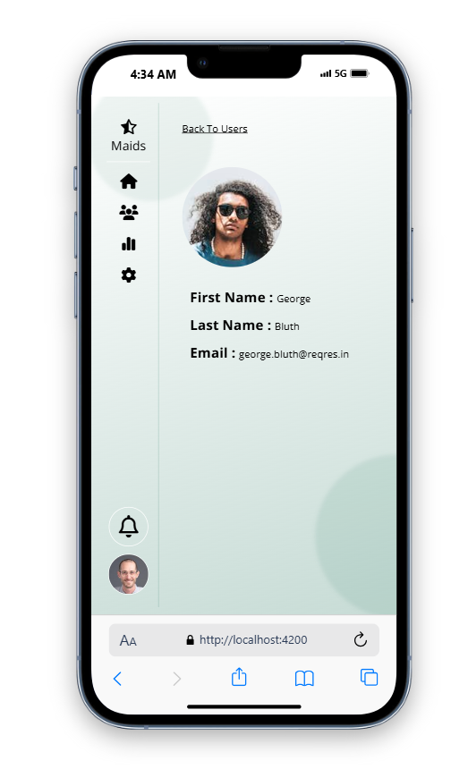

# 🌟 Angular 18 Dashboard with PrimeNG 🌟

A user-friendly, customizable dashboard with a vibrant design, clean code, and full responsiveness across all screen sizes. Ideal for various projects, this dashboard combines functionality with an appealing look.

---

## 🚀 Key Features
- 🎨 **Vibrant colors and modern design**
- 📱 **Fully responsive for all devices**
- 🧹 **Clean, well-structured code for easy customization**
- 📊 **Integrated with PrimeNG, RxJS, NgRx, and AmCharts for dynamic data visualization**

---

## 📸 Dashboard Preview
Take a look at the dashboard in action:




---

## 🚀 Getting Started

To get started with the dashboard, follow these steps:

```bash
git clone https://github.com/mhamad66/maids-dashboard.git

npm install

npm start

The dashboard should now be running locally at http://localhost:4200!

